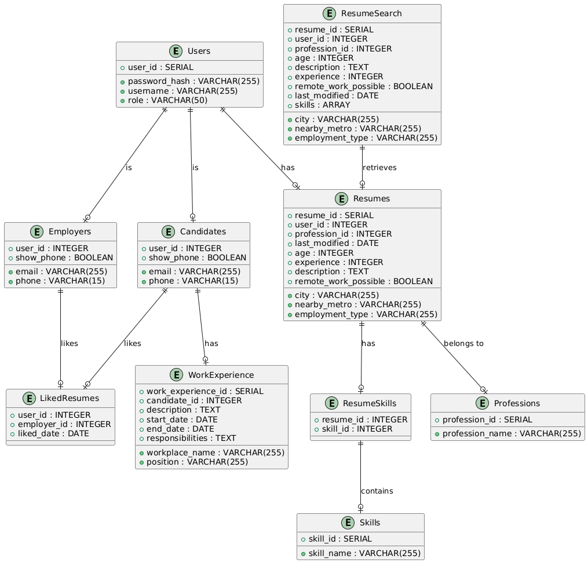

## Курсовой проект по Базам данных
   

В данном проекте был реализован сервис создания и поиска резюме для
соискателей и работодателей. Сервис представлен в виде веб-приложения
на Python фреймворке Streamlit с использованием контекстного менеджера из библиотки contextlib а также psycopg2 для работы с БД. База данных использует СУБД PostgreSQL. Для хеширования паролей пользователей применяется bcrypt из библиотки passlib.hash.  
Передача параметров в SQL запрос происходит безопасно через parameters для защиты от SQL injection.    
Была реализована авторизация пользователей с разделением ролей на
администраторов сайта, работодателей и кандидатов. Работодатель имеет
возможность просматривать все резюме пользователей, сохранять
наиболее релевантные и связываться с владельцем резюме любым
удобным ему способом. Кандидаты имеют возможность выкладывать в
общий доступ свое резюме и редактировать в любой удобный момент.  
Система автоматически редактирует базу данных и с большим
количеством пользователей обеспечивает более удобный поиск резюме
для пользователей сайта благодаря системе тегов с подсказками,
сортировке объявлений и фильтрации. Участие администраторов сайта
требуется только лишь для добавления новых специальностей.  

### Для запуска:  

Клонируем репозиторий:
```
git clone https://github.com/mrcirniko/Course-Project-DB.git
```
Устанавливаем необходмые компоненты:
```
pip install -r .\requirements.txt
```
Копируем скрипты для создания базы данных
```
cd src
cp ./migrations/ddl.sql /tmp
cp ./migrations/dml.sql /tmp
```
Инициализируем базу данных, создаем таблицы, нужные процедуры и триггеры и заполняем тестовыми значениями строки:
```
sudo -i -u postgres
createdb mydb
psql -d mydb
\i /temp/ddl.sql
\i /temp/dml.sql
```
Запускаем проект:
```
streamlit run app.py
```
